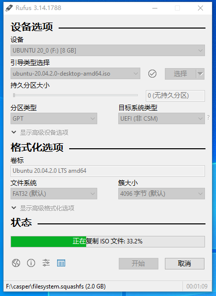

# 在 Ubuntu20.04 上搭建深度学习环境

首先 [下载 Ubuntu Desktop](https://ubuntu.com/download/desktop)，然后使用 [rufs](https://rufus.ie/) 制作 U 盘启动盘，并作如下配置：



最后，便可以安装 Ubuntu 了。

安装完毕之后需要做一些配置。

## 初级配置

- 智能升级。安装新软件包并删除废弃的软件包：

```sh
$ sudo apt-get dist-upgrade
$ sudo apt-get autoremove
```

- 删除一些不需要的内置软件：

```sh
$ sudo apt-get remove libreoffice-common
$ sudo apt-get remove unity-webapps-common
$ sudo apt-get autoremove
```

- 更新和升级系统

```sh
$ sudo apt update
$ sudo apt upgrade
```

- 安装 Git

```sh
$ sudo apt-get install git
```

配置 git 的两个重要信息，`user.name` 和 `user.email`，终端输入如下命令即可设置

```sh
$ git config --global user.name "Your Name"
$ git config --global user.email "email@example.com"
```

- 支持挂载 exfat

```sh
$ sudo apt-get install exfat-fuse
```

- 安装 g++ gcc 开发必备编译库（为之后安装 CUDA 做准备）

```sh
$ sudo apt-get install build-essential
```

- 为了支持 ssh server，需要：

```sh
$ sudo apt-get install openssh-server
$ sudo /etc/init.d/ssh start
$ sudo service ssh start
```

- 为了防止 Ubuntu 系统被玩坏了，我们需要一个可以进行备份和还原的工具：TimeShift

```sh
$ sudo apt-add-repository -y ppa:teejee2008/ppa
$ sudo apt update
$ sudo apt install timeshift
```

## 配置 GPU

安装最新的 Nvidia 驱动程序：


下面使用 {term}`MobaXterm` 远程操作 Ubuntu。

````{describe} 查看显卡型号
```shell
lspci | grep -i nvidia 
```
输出：

```
02:00.0 VGA compatible controller: NVIDIA Corporation TU102 [GeForce RTX 2080 Ti] (rev a1)
02:00.1 Audio device: NVIDIA Corporation TU102 High Definition Audio Controller (rev a1)
02:00.2 USB controller: NVIDIA Corporation TU102 USB 3.1 Host Controller (rev a1)
02:00.3 Serial bus controller [0c80]: NVIDIA Corporation TU102 USB Type-C UCSI Controller (rev a1)
```
````

````{describe} 查看驱动版本
```shell
sudo dpkg --list | grep nvidia-* 
```
输出：

```
02:00.0 VGA compatible controller: NVIDIA Corporation TU102 [GeForce RTX 2080 Ti] (rev a1)
02:00.1 Audio device: NVIDIA Corporation TU102 High Definition Audio Controller (rev a1)
02:00.2 USB controller: NVIDIA Corporation TU102 USB 3.1 Host Controller (rev a1)
02:00.3 Serial bus controller [0c80]: NVIDIA Corporation TU102 USB Type-C UCSI Controller (rev a1)
```
````

**重启**（此时重启最为重要）电脑查看 Nouveau 是否被禁用（**这里应该是没有任何的输出的**）（这是最关键的一步）：

```shell
lsmod | grep nouveau 
```

> 若有输出则说明 Nouveau 还在使用。做深度学习，要用到 NVIDIA 的显卡，因此需要改显卡驱动，禁用`nouveau`。即以管理员是身份打开 `/etc/modprobe.d/blacklist.conf` 文件，然后添加内容：`blacklist nouveau  #添加数据` 用来禁用 `nouveau`。而打开文件我们可以使用 vscode 进行文件编辑：

```sh
$ sudo code /etc/modprobe.d/blacklist.conf
```

验证 GPU 驱动是否正确安装：

```shell
$ nvidia-smi
$ nvidia-settings
```

出现下图便表示安装成功：


````{describe} 安装 CUDA 11.3

```shell
$ wget https://developer.download.nvidia.com/compute/cuda/11.3.1/local_installers/cuda_11.3.1_465.19.01_linux.run
$ sudo sh cuda_11.3.1_465.19.01_linux.run
```

因为我们已经安装了 Nvidia 驱动，会提醒移除，此时我们先 Continue，然后选掉 Driver：


安装完毕，会显示：


````

警告里面关于 CUDA driver 的内容不用管，说的就是没装 NVIDIA driver。

配置环境变量中的路径变量(PATH)：

```shell
$ sudo gedit ~/.bashrc
```

在最后一行加入路径：

```shell
export PATH="/usr/local/cuda-11.3/bin:$PATH"
export LD_LIBRARY_PATH="/usr/local/cuda-11.3/lib64:$LD_LIBRARY_PATH"
```

保存之后，为了使这个修改立即生效，还需要输入如下代码（如果不执行 source 命令，则需重启系统才能生效）：

```shell
$ source ~/.bashrc
```

此时便可以查看 CUDA 版本：

```shell
$ nvcc -V
```